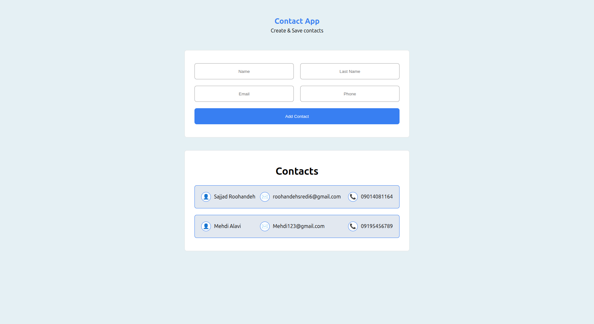

<h1 align="center">📇 Modern React Contact Management</h1>

  <b>A clean, responsive, and interactive contact management app built with React</b> 
  🌐 <a href="https://sajjadr17.github.io/contact-app-react/">View Live Demo</a> •
  💾 <a href="https://github.com/SajjadR17/contact-app-react">View on GitHub</a>

---

## 🎨 Preview

  

---

## 🧠 About The Project

Modern React Contact Management is a front-end contact manager application built with React.

This project focuses on:

- Managing form state efficiently
- Handling four controlled inputs with a single function
- Implementing form validation logic
- Preventing duplicate contacts
- Creating a clean and responsive UI

The app allows users to add contacts only when all required inputs are valid and prevents duplicate entries based on name or phone number.

---

## 📊 Features

✅ Add new contacts  
✅ Four controlled inputs managed by one handleChange function  
✅ Validation for empty inputs  
✅ Prevent duplicate name entries  
✅ Prevent duplicate phone number entries  
✅ Error handling and user feedback  
✅ Dynamic contact list rendering  
✅ Clean and responsive design  

---

## 🧠 Form Validation Logic

The form includes four input fields, all controlled by a single state handler.

### Validation Rules:

- All fields are required  
- No empty inputs allowed  
- Name must be unique  
- Phone number must be unique  
- If validation fails → error message is displayed  
- If validation passes → contact is added to the list  

---

## ⚙️ Tech Stack

| Technology | Usage |
|------------|--------|
| React JS | Component-based UI |
| useState Hook | State management |
| JavaScript (ES6+) | Validation & logic |
| CSS3 | Styling & responsiveness |

---

## 🚀 How To Run Locally

bash
git clone https://github.com/SajjadR17/contact-app-react.git
cd react-contact-management
npm install
npm start

---

## 🧾 License

This project is licensed under the MIT License.
You are free to use, modify, and share it with proper credit.